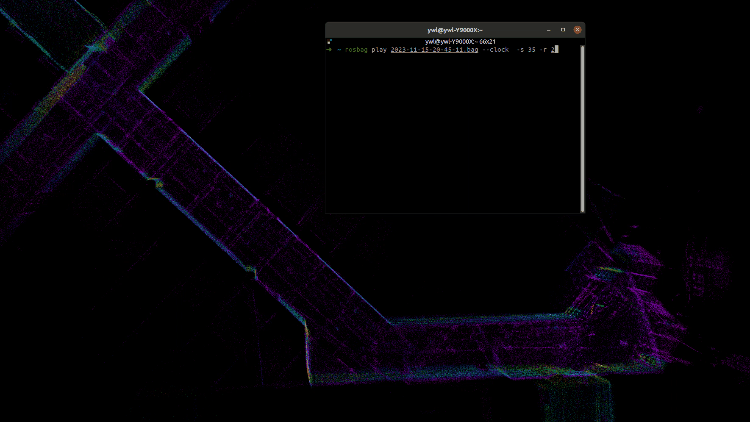

# FAST-LOCALIZATION
**A LiDAR-Inertial localization package based on [FAST-LIO2](https://github.com/hku-mars/FAST_LIO), operating with a known prior map.**
<p align="center">
  
  <br>
  <em>Fig 1 :Indoor test without manual input of the initial pose</em>
</p>

<p align="center">
  

  <br>
  <em>Fig 2 :Initial pose given by ScanContext(left)  and Localization detail(right)</em>
</p>

## 0. Features
FAST-LOCALIZATION is a framework for relocalization in a known map, based on [FAST-LIO2](https://github.com/hku-mars/FAST_LIO). It employs [ScanContext](https://github.com/irapkaist/scancontext) for initial global localization. Compared to [FAST_LIO_LOCALIZATION](https://github.com/HViktorTsoi/FAST_LIO_LOCALIZATION), FAST-LOCALIZATION does not require manual input of the initial pose. By utilizing continuous global point cloud constraints, it achieves more stable and globally consistent accurate pose estimates.
## 1. Prerequisites
### 1.1 **Ubuntu** and **ROS**
**Ubuntu >= 16.04**

ROS    >= Melodic. [ROS Installation](http://wiki.ros.org/ROS/Installation)

### 1.2. **PCL && Eigen && OpenCV**
PCL    >= 1.8,   Follow [PCL Installation](http://www.pointclouds.org/downloads/linux.html).

Eigen  >= 3.3.4, Follow [Eigen Installation](http://eigen.tuxfamily.org/index.php?title=Main_Page).

Opencv >= 3.2.0, Follow[OpenCV_installation](https://github.com/opencv/opencv)
### 1.3. **livox_ros_driver**
Follow [livox_ros_driver Installation](https://github.com/Livox-SDK/livox_ros_driver).

## 2. Build

Clone the repository and catkin_make:

```
    cd ~/$A_ROS_DIR$/src
    git clone https://github.com/YWL0720/FAST-LOCALIZATION
    cd FAST-LOCALIZATION
    git submodule update --init
    cd ../..
    catkin_make
    source devel/setup.bash
```
- Remember to source the livox_ros_driver before build (follow 1.3 **livox_ros_driver**)
- If you want to use a custom build of PCL, add the following line to ~/.bashrc
  ```export PCL_ROOT={CUSTOM_PCL_PATH}```

## 3. Map Preparation
FAST-LOCALIZATION can seamlessly integrate with [HBA](https://github.com/hku-mars/HBA)(A Globally Consistent and Efficient Large-Scale LiDAR Mapping Module), enabling real-time localization within maps optimized by HBA. It requires placing the point cloud file for each map frame and the corresponding pose files in the map/ directory. Noted the format of the pose is tx ty tz qw qx qy qz.
```
.
├── pcd
│   ├── 0.pcd
│   └── 1.pcd
└── pose.json
```

## 4. Run
```
roslaunch fast_localization localization_mid360.launch
```
## 5. TODO
- Code Optimization
- Manual Initialization Interface

## 6.Acknowledgments

Thanks for [FAST-LIO2](https://github.com/hku-mars/FAST_LIO), [HBA](https://github.com/hku-mars/HBA) and [ScanContext](https://github.com/irapkaist/scancontext)